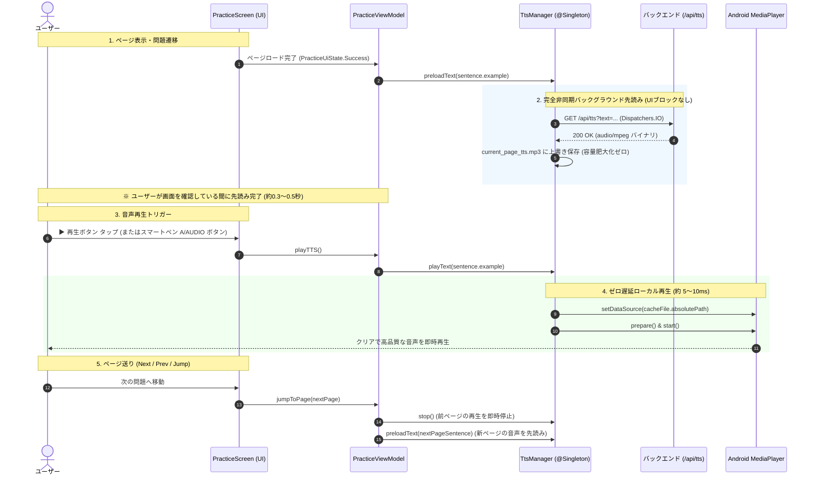

# TOEIC Dictation App: TTS (音声読み上げ) アーキテクチャ仕様書

本書は、TOEIC ディクテーション・リスニング学習アプリにおける **TTS（Text-to-Speech: 音声読み上げ）機能の公式採用アーキテクチャおよび完全実装仕様** です。
ゼロベース（最初から）アプリを再構築、あるいは別プラットフォームへ展開する際、後続の開発者および AI Agent が迷わず最速・最高品質の再生機構を組み込める「羅針盤（Compass）」として機能します。

> [!NOTE]
> **Image to Text（手書き文字起こし）について**  
> 現在 ML Kit Digital Ink と LLM（Gemini 3.5 Flash Lite）によるハイブリッド構成等を検証中のため、本仕様書には含めていません。検証完了後に追記予定です。

---

## 1. 背景と設計方針

### 1.1 過去の課題と検証結果
英語ディクテーション学習において、音声再生の「レスポンス速度」は学習体験（UX）を決定づける最重要要素です。本プロジェクトでは以下の方式を比較・検証しました。

1. **オンデマンド取得方式（ボタンを押してから取得）**:
   - 再生ボタンを押した後に HTTP リクエストを発行するため、API応答・ネットワーク遅延により **毎回 0.5〜1.5 秒の待機ラグ** が発生。テンポが著しく悪化。
2. **チャンクストリーミング再生方式（WebSocket / HTTP Chunk + AudioTrack）**:
   - 最初の数バイト到着時に即再生を試みたが、Android OS のオーディオバッファ管理において **バッファアンダーランによる音割れ・雑音ノイズ** が頻発。
   - 実装が極度に複雑化し、不安定さの原因となったため **完全廃止** を決定。
3. **【採用決定】先読みプリロード ＋ 単一ファイルキャッシュ ＋ MediaPlayer 即時再生**:
   - ページ表示時にユーザーが英文を読んでいる裏（バックグラウンド）で音声を先読み完了。
   - ボタンを押した瞬間、**端末ローカルから 5〜10ms（人間の体感でゼロ遅延）で安定再生**。
   - キャッシュは常に「現在のページ1ファイルのみ（約数十KB）」を上書き維持し、端末ストレージの肥大化を完全防止。

---

## 2. アーキテクチャ全体図



---

## 3. 主要設計原則（Core Rules）

### ① 端末ストレージの完全保護（単一ファイル上書き）
- キャッシュ先は `context.cacheDir` 配下の **`current_page_tts.mp3` 1ファイルのみ**。
- ページを 1,000 ページめくっても、ストレージ消費は常に **1ファイル（約 20〜100 KB）固定**。
- アプリ再インストールや手動キャッシュクリアをユーザーに要求しない「クリーンな永続設計」。

### ② 競合・レースコンディションの完全排除（スレッドセーフ）
- **書き込み途中読み込みの防止**: 一旦 `current_page_tts.tmp` に書き込み、完了後にアトミックに `current_page_tts.mp3` へリネーム・上書き。
- **先読み中にボタンが押された場合（早押しセーフティ）**:
  - ページを開いて 0.1 秒以内に ▶ ボタンが押された場合、`preloadJob?.join()` によりバックグラウンド通信の完了を待機し、完了次第シームレスに再生へ移行。エラーや再生不能を起こさない。
- **連続タップ耐性**:
  - 再生中フラグ（`_isTtsPlaying`）および `mediaPlayer?.stop()` により、連打時の二重再生やクラッシュを防止。

### ③ ライフサイクル連動とリソース解放
- ページ移動（`jumpToPage`）時は直ちに `ttsManager.stop()` を呼び出し、前の問題の音声が鳴り続ける違和感を排除。
- ViewModel 破棄時（`onCleared()`）には `ttsManager.release()` を呼び出し、実行中のコルーチンをキャンセルし `MediaPlayer` のネイティブメモリを解放。

---

## 4. API インターフェース仕様

### エンドポイント仕様
- **URL**: `GET /api/tts`
- **Query Parameter**:
  - `text` (string, URLエンコード必須): 読み上げる英文テキスト
- **Response**:
  - **Content-Type**: `audio/mpeg`
  - **Status Code**: `200 OK`
  - **Body**: MP3 音声バイナリデータ

### Retrofit インターフェース定義
```kotlin
interface ToeicApiService {
    @GET("/api/tts")
    suspend fun getTTS(
        @Query("text") text: String
    ): Response<ResponseBody>
}
```

---

## 5. 実装コード（コンパス・リファレンス）

ゼロからアプリを実装する際は、以下の構成をそのまま利用・移植してください。

### 5.1 `TtsManager.kt` (音声管理のコア)
```kotlin
package com.example.myapplication.ui.practice

import android.content.Context
import android.media.MediaPlayer
import com.example.myapplication.domain.ToeicRepository
import dagger.hilt.android.qualifiers.ApplicationContext
import kotlinx.coroutines.*
import java.io.File
import java.io.FileOutputStream
import javax.inject.Inject
import javax.inject.Singleton
import kotlin.coroutines.resume
import kotlin.coroutines.resumeWithException

@Singleton
class TtsManager @Inject constructor(
    @ApplicationContext private val context: Context,
    private val repository: ToeicRepository
) {
    private val coroutineScope = CoroutineScope(SupervisorJob() + Dispatchers.IO)
    private var preloadJob: Job? = null

    @Volatile
    private var cachedText: String? = null
    private val cacheFile by lazy { File(context.cacheDir, "current_page_tts.mp3") }

    private var mediaPlayer: MediaPlayer? = null

    /**
     * 現在ページのTTS音声をバックグラウンドで先読みし、単一ファイルに上書き保存する。
     * 端末ストレージは常に1ファイル分（数十KB）のみ維持される。
     */
    fun preloadText(text: String) {
        val trimmed = text.trim()
        if (trimmed.isBlank()) return
        // すでに同一テキストがキャッシュされている場合は再取得をスキップ
        if (cachedText == trimmed && cacheFile.exists() && cacheFile.length() > 0L) {
            return
        }

        preloadJob?.cancel()
        preloadJob = coroutineScope.launch {
            fetchAndCache(trimmed)
        }
    }

    private suspend fun fetchAndCache(text: String): Boolean {
        return try {
            val response = repository.getTTS(text)
            if (response.isSuccessful) {
                val body = response.body()
                if (body != null) {
                    val tempFile = File(context.cacheDir, "current_page_tts.tmp")
                    FileOutputStream(tempFile).use { it.write(body.bytes()) }
                    if (cacheFile.exists()) cacheFile.delete()
                    if (!tempFile.renameTo(cacheFile)) {
                        tempFile.copyTo(cacheFile, overwrite = true)
                        tempFile.delete()
                    }
                    cachedText = text
                    return true
                }
            }
            false
        } catch (e: CancellationException) {
            false
        } catch (e: Exception) {
            false
        }
    }

    /**
     * キャッシュからゼロ遅延（約5〜10ms）で音声を再生する。
     * 未完了の場合は先読みの終了を待機して即再生する。
     */
    suspend fun playText(text: String) {
        val trimmed = text.trim()
        withContext(Dispatchers.IO) {
            try {
                // 先読みが実行中の場合は待機
                if (preloadJob?.isActive == true) {
                    preloadJob?.join()
                }

                // 未キャッシュまたは別テキストの場合は直ちに取得
                if (cachedText != trimmed || !cacheFile.exists() || cacheFile.length() == 0L) {
                    val success = fetchAndCache(trimmed)
                    if (!success) return@withContext
                }

                // メインスレッドで MediaPlayer を起動（ゼロ遅延再生）
                withContext(Dispatchers.Main) {
                    stop()
                    suspendCancellableCoroutine<Unit> { continuation ->
                        val player = MediaPlayer()
                        mediaPlayer = player

                        player.apply {
                            setDataSource(cacheFile.absolutePath)
                            setOnCompletionListener {
                                release()
                                if (mediaPlayer == it) mediaPlayer = null
                                if (continuation.isActive) continuation.resume(Unit)
                            }
                            setOnErrorListener { it, _, _ ->
                                release()
                                if (mediaPlayer == it) mediaPlayer = null
                                if (continuation.isActive) continuation.resumeWithException(Exception("MediaPlayer error"))
                                true
                            }
                            try {
                                prepare()
                                start()
                            } catch (e: Exception) {
                                release()
                                if (mediaPlayer == this) mediaPlayer = null
                                if (continuation.isActive) continuation.resumeWithException(e)
                            }
                        }

                        continuation.invokeOnCancellation {
                            player.release()
                            if (mediaPlayer == player) mediaPlayer = null
                        }
                    }
                }
            } catch (e: Exception) {
                e.printStackTrace()
            }
        }
    }

    /**
     * 現在の再生を安全に停止・リセット
     */
    fun stop() {
        try {
            mediaPlayer?.stop()
            mediaPlayer?.release()
            mediaPlayer = null
        } catch (e: Exception) {
            mediaPlayer = null
        }
    }

    /**
     * ViewModel 破棄時の完全クリーンアップ
     */
    fun release() {
        preloadJob?.cancel()
        stop()
    }
}
```

---

### 5.2 `PracticeViewModel.kt` (ライフサイクル連動)
```kotlin
// 1. 初期化時に StateFlow を監視し、ページが確定したら自動先読み
init {
    viewModelScope.launch {
        _uiState.collect { state ->
            if (state is PracticeUiState.Success) {
                val text = state.sentence.example
                if (!text.isNullOrBlank()) {
                    ttsManager.preloadText(text)
                }
            }
        }
    }
}

// 2. 再生アクション (画面ボタン or スマートペンからの入力)
fun playTTS() {
    if (_isTtsPlaying.value) return

    val currentState = _uiState.value
    if (currentState is PracticeUiState.Success) {
        viewModelScope.launch {
            _isTtsPlaying.value = true
            try {
                ttsManager.playText(currentState.sentence.example)
            } finally {
                _isTtsPlaying.value = false
            }
        }
    }
}

// 3. ページ移動時: 前の音声の停止
fun jumpToPage(targetPage: Int) {
    val currentState = _uiState.value
    if (currentState is PracticeUiState.Success) {
        val page = targetPage.coerceIn(1, currentState.totalPages)
        if (page == currentState.currentPage) return

        ttsManager.stop()
        _isTtsPlaying.value = false

        viewModelScope.launch {
            // ... 次のページをロード (_uiState が Success になり、自動的に新音声が先読みされる)
        }
    }
}

// 4. 画面破棄時
override fun onCleared() {
    super.onCleared()
    ttsManager.release()
}
```

---

### 5.3 `PracticeScreen.kt` (UI コンポーネント)
```kotlin
IconButton(
    onClick = { viewModel.playTTS() },
    enabled = !isTtsPlaying
) {
    Icon(
        imageVector = Icons.Default.PlayArrow,
        contentDescription = "TTS",
        tint = if (isTtsPlaying) MaterialTheme.colorScheme.primary else MaterialTheme.colorScheme.onSurface
    )
}
```

---

## 6. 新規開発時チェックリスト

新しくアプリを作成する、または新画面に TTS を追加する場合は、以下を順番に確認してください：

- [ ] `TtsManager` が `@Singleton` で DI（Hilt / Koin）に登録されているか。
- [ ] キャッシュファイルが特定ディレクトリの単一ファイル（`current_page_tts.mp3`）に固定されているか。
- [ ] 画面またはアイテム表示のライフサイクル（StateFlow / イベント）と連動して `preloadText()` が呼ばれているか。
- [ ] 画面遷移・アイテム切り替え時に `stop()` が呼ばれているか。
- [ ] ViewModel の `onCleared()` で `release()` が呼ばれているか。
